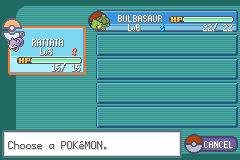

## Move Pokémon with the Select Button

Adds the ability to move Pokémon in the party menu with the Select button, instead of needing to choose the `SWITCH` option. To clarify, this is not the "automatically move to first slot" that was introduced in SV.



### Build Instructions

See [here](https://gist.github.com/Zeturic/db1611cc7b17c3140f9b9af32e1b596b) for the prequisites and help in installing them.

#### Cloning the repo

Open your terminal to whatever folder you want to download this repo into. Then, do the following to download the repo and build the included tools:

```shell
$ git clone https://github.com/Zeturic/bpre-switch-pokemon-button.git
$ cd bpre-switch-pokemon-button
```

#### Adding your ROM

Copy your ROM to this directory and rename it `rom.gba`.

#### Configuration

The build system is smart enough to find enough free space on its own, but if you want it to be inserted at a particular address, you can specify it by updating the definition of `START_AT` in `config.mk`.

If the given address is acceptable (i.e. is word-aligned and has enough bytes of free space), it will be inserted there. Otherwise, it will just use `START_AT` to determine where in the ROM it should start looking for free space.

#### Building the project itself

Once you're ready, run the following to build the project:

```shell
make
```

This won't actually modify `rom.gba`, instead your output will be in `test.gba`. Naturally, test it in an emulator.

### Credits

The project structure and some of the build tools are from [pokefirered](https://github.com/pret/pokefirered). Additionally, some in-game code was taken from pokefirered to modify.
